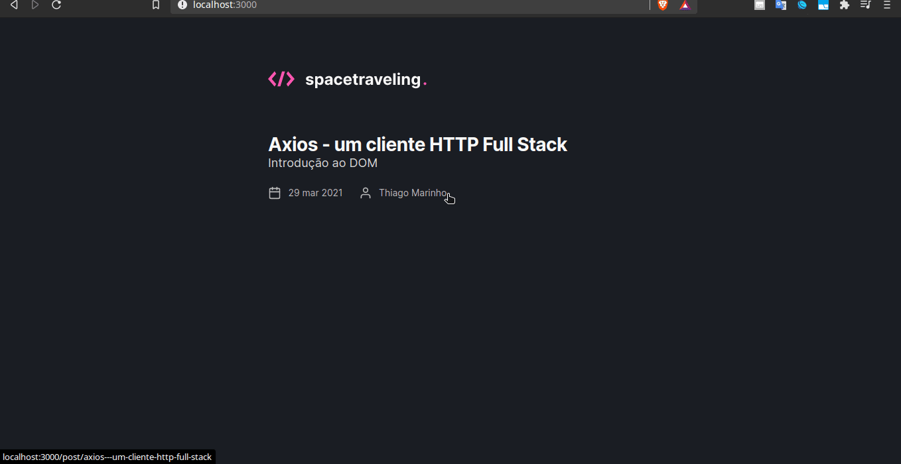

  

 

<h1 align="center">
    
</h1>

  <a href="#technologies">Technologies</a>&nbsp;&nbsp;&nbsp;|&nbsp;&nbsp;&nbsp;
  <a href="#-project">Project</a>&nbsp;&nbsp;&nbsp;|&nbsp;&nbsp;&nbsp;
  <a href="#-layout">Template</a>&nbsp;&nbsp;&nbsp;|&nbsp;&nbsp;&nbsp;
  <a href="#-license">License</a>

 

## 🧪 Technologies

This project was developed using the following technologies:

- [React](https://reactjs.org)
- [NextJS](https://nextjs.org/)
- [Prismic](https://prismic.io/)
- [Date FNS](https://date-fns.org/)
- [TypeScript](https://www.typescriptlang.org/)
- [SASS](https://sass-lang.com/)

## 💻 Project

Conclusion project for chapter three. It was developed with everything I’ve learned so far at Ignite.

## 🔖 Template

You can view the project template through the links below:

- [Application Template](https://github.com/rocketseat-education/ignite-template-reactjs-criando-um-projeto-do-zero)

## 📝 License

This project is licensed under the MIT License.
